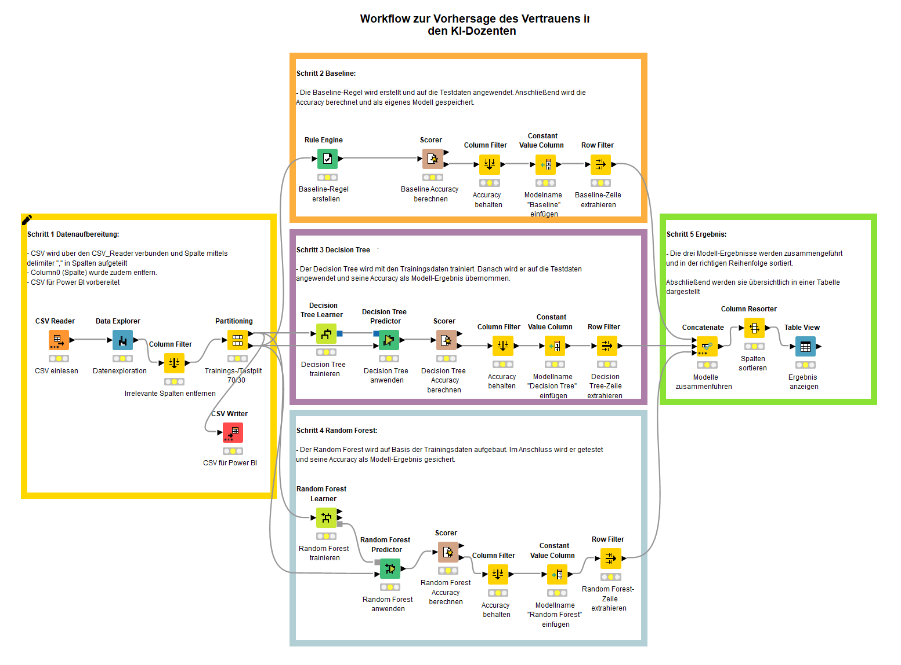
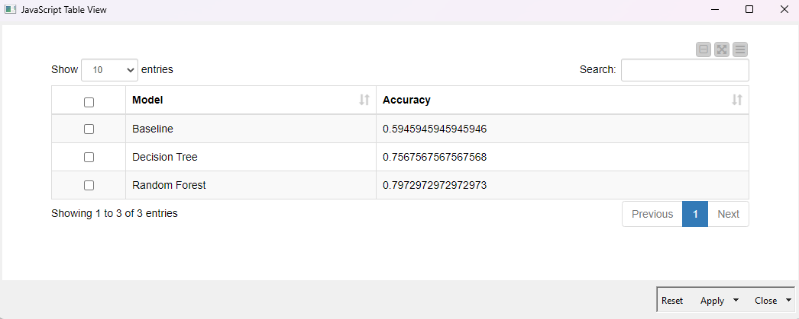
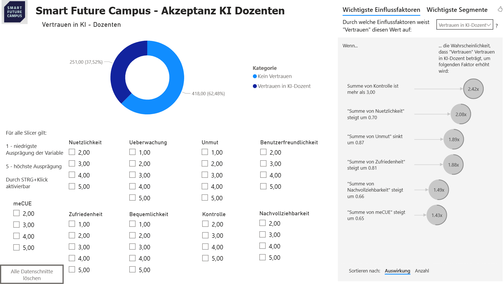

# KI-Teacher-Trust-Analysis
Datenanalyse und ML-Modellierung zur Vorhersage des Vertrauens in KI-Dozenten mit KNIME und Power BI.
# 🤖 KI-Dozent Vertrauensanalyse – Smart Future Campus

Dieses Projekt analysiert die Akzeptanz und das Vertrauen von 246 Absolventen in einen KI-basierten Dozenten. Ziel ist es, durch Machine Learning Vorhersagemodelle zu erstellen und die wichtigsten Einflussfaktoren in einem Dashboard visualisiert darzustellen.

---

## 📋 1. Projektszenario & Aufgabe
Der Bildungsanbieter **Smart Future Campus** setzt testweise KI-Dozenten ein. Um die Einführung zu optimieren, wurden Daten zur Nutzererfahrung erhoben.
* **Ziel:** Vorhersage, ob ein Nutzer der KI vertraut oder nicht.
* **Datensatz:** 246 Datensätze mit Faktoren wie Nuetzlichkeit, Kontrolle und technischer Affinität.

---

## ⚙️ 2. Datenmodellierung (KNIME)
In KNIME wurde ein Workflow zur Klassifikation entwickelt. Dabei wurden verschiedene Modelle (Decision Tree & Random Forest) verglichen.

### Workflow-Struktur:
1. **Datenaufbereitung:** Bereinigung und Vorbereitung der Absolventendaten.
2. **Modell-Training:** Einsatz von Random Forest zur Klassifikation.
3. **Validierung:** Vergleich der Modelle anhand der Accuracy.

### Ergebnisse:
Das Random Forest Modell erzielte die beste Performance bei der Vorhersage des Vertrauens.

---

## 📊 3. Dashboard & Insights (Power BI)
Das Power BI Dashboard visualisiert die demografische Verteilung und identifiziert die wichtigsten "Key Influencer" für das Vertrauen in die KI.

**Wichtigste Erkenntnisse:**
* **Kontrolle ist entscheidend:** Nutzer, die eine hohe Kontrolle (> 3.0) empfinden, vertrauen der KI mit einer 2,4-fach höheren Wahrscheinlichkeit.
* **Nützlichkeit:** Die wahrgenommene Nützlichkeit ist der zweitstärkste Faktor für die Akzeptanz.

---

## 📂 Ordnerstruktur
* `00_Task`: Originale Aufgabenstellung (PDF).
* `01_Data`: Verwendeter Datensatz (CSV).
* `02_KNIME_Model`: Workflow-Datei (.knwf) und Screenshots.
* `03_PowerBI_Dashboard`: Dashboard-Datei (.pbix) und Screenshot.
* `04_Presentation_Docs`: Abschlusspräsentation und Dokumentation.

---
*Erstellt im Rahmen des Moduls Datenanalyse / Machine Learning.*
